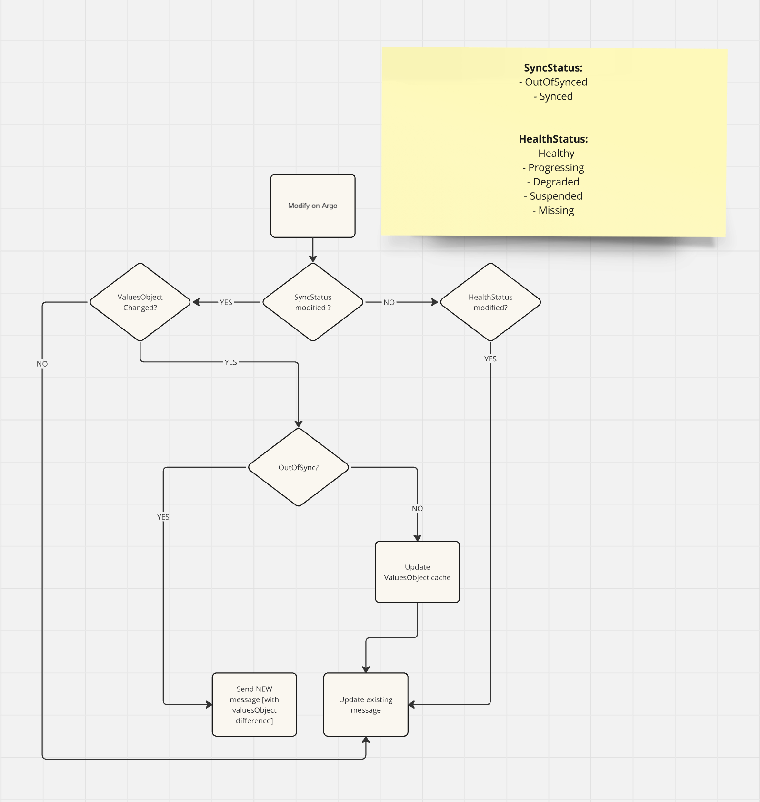

# ArgoCD Watcher Notifier

## Overview

The ArgoCD Watcher Notifier is a service that monitors ArgoCD applications and sends notifications to Slack based on the health and sync status of the applications. It uses environment variables for configuration and can be run locally or in a Docker container.

## Environment Variables

The application requires the following environment variables to be set:

- `K8S_CRD_GROUP`: The Kubernetes Custom Resource Definition group.
- `K8S_CRD_VERSION`: The Kubernetes Custom Resource Definition version.
- `K8S_NAMESPACE`: The Kubernetes namespace.
- `SLACK_TOKEN`: The Slack API token. Required if you want to use Slack in production.
- `SLACK_CHANNEL_ID`: The Slack channel ID. Required if SLACK_TOKEN is set.
- `ARGO_CD_URL`: The ArgoCD UI URL.

You can use the `.env.example` file as a template for your `.env` file.

## Docker Images

The application can be built and run using Docker. The Dockerfile is included in the repository.

## Scripts

### Initialize Project Locally

To initialize the project locally, follow these steps:

1. **Install Dependencies:**

```sh
yarn install
```

2. Set Up Environment Variables: Copy the `.env.example` file to `.env` and fill in the required values.

3. Start the Application in Development Mode:

```sh
yarn start:dev
```

4. Start the Application in Debug Mode:

```sh
yarn start:debug
```

### Initialize Project in Production

To initialize the project in production, follow these steps:

1. Build the Project:

```sh
yarn build
```

2. Start the Application:

```sh
yarn prod
```

### Using Docker

1. Build and Start the Docker Container:

```sh
yarn docker:compose:up
```

2. Stop the Docker Container:

```sh
yarn docker:compose:down
```

## Main Logic

The main logic of the application is implemented in the `ArgoCdApplicationResourceManager` class located in `src/resource-manager/argocd-application.resource-manager.ts`. This class extends the `BaseResourceManager` and handles the synchronization of ArgoCD resources and sending notifications to Slack.

### Key Methods:

- `syncResource`: Synchronizes the resource and updates the cache.
- `sendNotification`: Sends a notification to Slack.
- `shouldIgnoreResource`: Determines if a resource should be ignored based on its specification.

# Troubleshooting

## If typescript doesn't work in vscode follow instructions in the link below:

https://yarnpkg.com/getting-started/editor-sdks

## Flowchart


